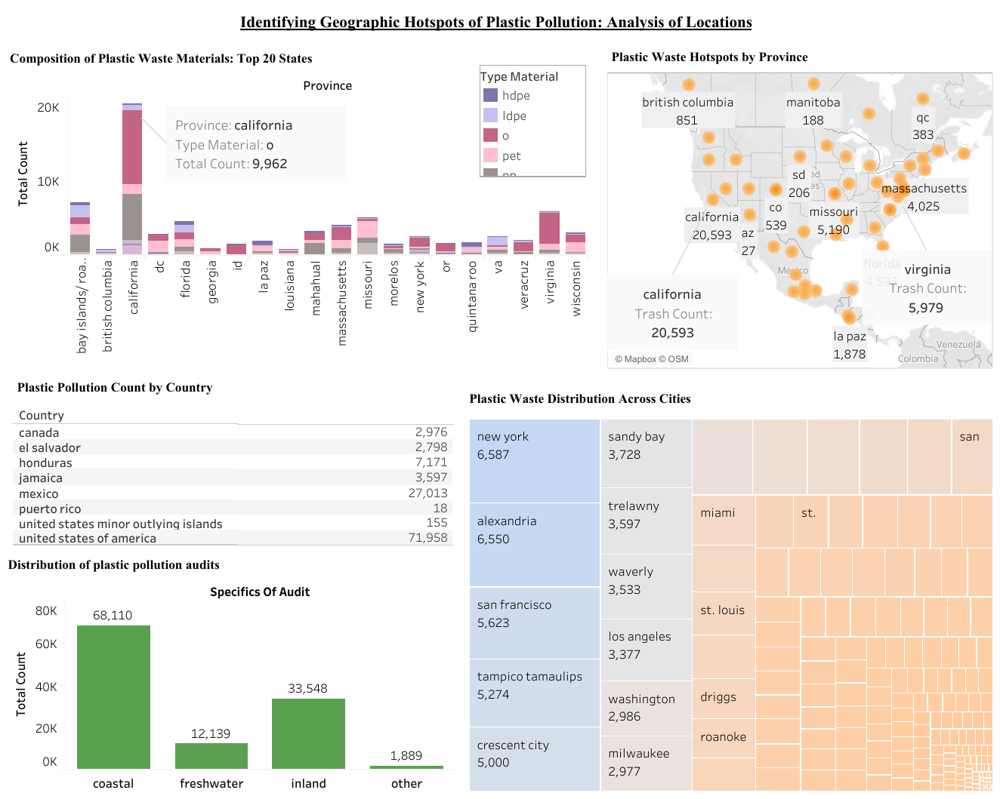

# Geospatial Data Analysis for Plastic Pollution

## Overview
This project involves a detailed geospatial data analysis of plastic pollution across North America, conducted from September 2023 to December 2023. In collaboration with the 5 Gyres Institute, we analyzed over 100,000 data points from diverse sources and environmental metrics to identify key pollution hotspots.

## Key Features
- **Collaborative Effort**: Partnered with the 5 Gyres Institute to analyze real-time plastic pollution data.
- **Geospatial Clustering Analysis**: Achieved 95% accuracy in identifying the top 10 geographical hotspots of plastic pollution using advanced Python libraries and statistical techniques.
- **Interactive Dashboard**: Created a Tableau dashboard to dynamically visualize and present findings, aiding stakeholders in making informed decisions.

## Technologies Used
- **Tableau**: For data visualization and interactive dashboard creation.
- **Python**: 
  - **Pandas**: For data manipulation and analysis.
  - **NumPy**: For numerical computations.
  - **Scikit-learn**: For machine learning and clustering analysis.
  - **Matplotlib**: For plotting and data visualization.
- **Microsoft Excel**: For initial data exploration and preprocessing.

## Data Sources
- The 5 Gyres Institute
- Various Environmental Metrics and Data Sources

## Analysis Metrics
- Geographical Hotspots
- Plastic Pollution Levels
- Environmental Impact Factors

## Dashboard

